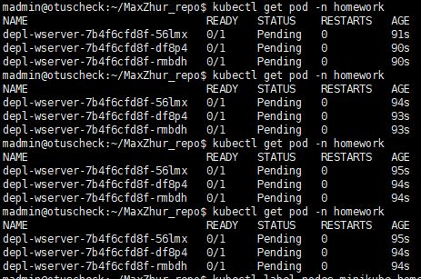
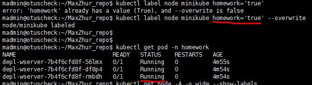
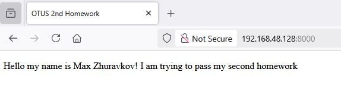
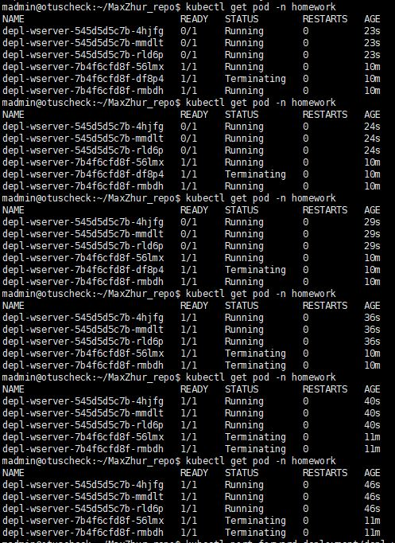

# Второе домашнее задание(ДЗ).
## Запуск и проверка
Проверялось на версии minikube 1.35, kubectl 1.32 на VM с Ubuntu 24.04
1. Клонируем ветку kubernetes-controllers туда, где есть настроенный minikube и kubectl.
2. Создаем новый namespace
```
kubectl apply -f kubernetes-controllers/namespace.yaml
```
3. Проверяем, что namecpace создался
```
kubectl get ns
```
4. Создаем деплоймент
```
kubectl apply -f kubernetes-controllers/deployment.yaml
```
5. Проверяем, что деплоймент создался
```
kubectl get deployment -n homework
```
6. Проверяем pod-ы в deployment. Поскольку в nemespace только один deployment - просто смотрим pod в namespace
```
kubectl get pod -n homework
```


7. Добавляем метку на хост minikube
```
kubectl label node minikube homework='true'
```
8. Выполняем пункт 6. Для проверки подов. ЗАДАНИЕ СО * ВЫПОЛНЕНО.


9. Проверка доступности вебсервера. Включаем порт форвард
```
kubectl port-forward deployment/depl-wserver -n homework --address 0.0.0.0 8000:8000
```
10.  Переходим по адресу http://IP_minikube_host:8000

11.  Проверка Rolling Update. В манифесте kubernetes-controllers/deployment.yaml поменять что-нить в генерации index.html
12. Обновить deployment, используя команду из пункта 4.
13. Проверить поды в namespace.




В стратегии RollingUpdate стоит недоступность максимум одного контейнера, но можно при апдейте поднимать два дополнительных.

