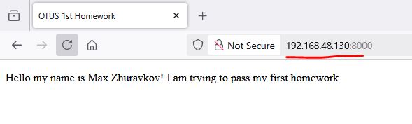

# Первое домашнее задание(ДЗ).

## Запуск ДЗ.
Проверялось на версии minikube 1.35, kubectl 1.32 на VM с Ubuntu 24.04
1. Клонируем ветку `kubernetes-intro` туда, где есть настроенный minikube и kubectl.
2. Создаем новый namespace
```
kubectl apply -f kubernetes-intro/namespace.yaml
```
3. Проверяем, что namecpace создался
```
kubectl get ns
```
4. Создаем pod
```
kubectl apply -f kubernetes-intro/pod.yaml
```
5. Проверяем статус pod
```
kubectl get pod -n homework
```

## Проверка ДЗ.
### Работоспособность веб-сервера
Необходимо знать ip адресс хоста с minikube.
1. Запускаем port-forward
```
kubectl port-forward --address 0.0.0.0 -n homework pod/wserver 8000:8000
```
2. Проходим по ссылке http://$minikube-hodt-ip:8000

### Удаление файла index.html при удалении pod
Таймаут на удаление пода, после удаления файла 120 секунд
1. Завершаем работу pod
```
kubectl delete pod wserver -n homework
```
2. Во втором терминальном окне смотрим логи pod
```
kubectl logs wserver -n homework
```
3. Можем зайти в командную оболочку контейнера
```
kubectl exec --stdin --tty wserver -n homework -- /bin/bash
```
4. И убедиться, что файл удален
```
ls /homework
```
