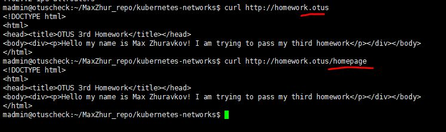

# Третье домашнее задание(ДЗ).
## Подготовка
Проверялось на версии minikube 1.35, kubectl 1.32 на VM с Ubuntu 24.04
1. Клонируем ветку kubernetes-networks туда, где есть настроенный minikube и kubectl.
2. Устанавливаем ingress-controller
```
minikube addons enable ingress
```
3. Находим IP адресс ноды minikube и прописываем его в /etc/hosts с алиасом homework.otus
```
kubectl get node -o wide
```


## Запуск
1. Поочередно создаем namespace, deployment, service и ingress
```
kubectl apply -f kubernetes-controllers/namespace.yaml
kubectl apply -f kubernetes-controllers/deployment.yaml
kubectl apply -f kubernetes-controllers/service.yaml
kubectl apply -f kubernetes-controllers/ingress.yaml
```
5. Проверяем, что страница доступна
```
curl http://homework.otus
```
6. Проверяем задание со звездочкой
```
curl http://homework.otus/homepage
```


При желаении можно настроить проброс средствами linux на внешний адрес ВМ.


