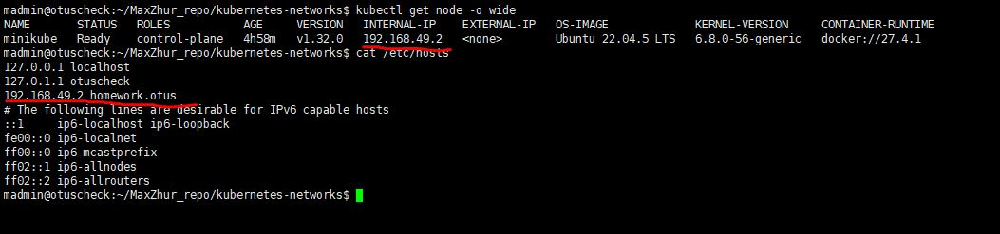
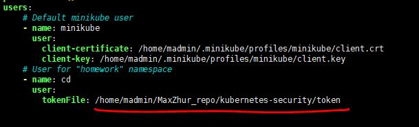
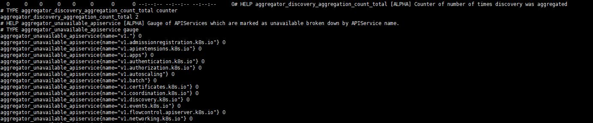

# Третье домашнее задание(ДЗ).
## Подготовка
Проверялось на версии minikube 1.35, kubectl 1.32 на VM с Ubuntu 24.04
1. Клонируем ветку kubernetes-security туда, где есть настроенный minikube и kubectl.
2. Устанавливаем ingress-controller
```
minikube addons enable ingress
```
3. Находим IP адресс ноды minikube и прописываем его в /etc/hosts с алиасом homework.otus
```
kubectl get node -o wide
```



## Запуск
1. Поочередно создаем namespace, configMaps, PVC, serviceAccounts, roles, roleBindings, deployment, service и ingress
```
kubectl apply -f kubernetes-security/namespace.yaml
kubectl apply -f kubernetes-security/cm.yaml
kubectl apply -f kubernetes-security/storageClass.yaml
kubectl apply -f kubernetes-security/pvc.yaml
kubectl apply -f kubernetes-security/sa/roles.yaml
kubectl apply -f kubernetes-security/sa/clusterRoles.yaml
kubectl apply -f kubernetes-security/sa/serviceAccounts.yaml
kubectl apply -f kubernetes-security/sa/roleBindings.yaml
kubectl apply -f kubernetes-security/sa/clusterRoleBindings.yaml
kubectl apply -f kubernetes-security/deployment.yaml
kubectl apply -f kubernetes-security/service.yaml
kubectl apply -f kubernetes-security/ingress.yaml
```
2. Генерируем токен для сервисного аккаунта cd  со сроком действия 24 часа, и записываем токе в файл
```
kubectl create token cd -n homework --duration=24h > kubernetes-security/token
```
3. В kubernetes-security/kubeconfig.yaml указываем полный путь к фалйу токена


## Проверка ДЗ
# 1. ServiceAccount  с доступом к metrics кластера. Заодно и задание со звездочкой.

Получение метрик осуществляется скриптом, который сохранен в configMap, файл kubernetes-security/cm.yaml

```
curl http://homework.otus/metrics.html | less
```

# 2. ServiceAccount с админскими правами на namespacehomework
```
kubectl --kubeconfig kubeconfig.yaml auth can-i get pods -n homework
kubectl --kubeconfig kubeconfig.yaml auth can-i get pods -n default
kubectl --kubeconfig kubeconfig.yaml auth can-i delete pod -n homework
kubectl --kubeconfig kubeconfig.yaml auth can-i delete pod -n default
```


