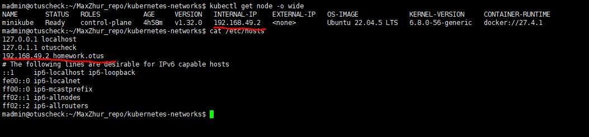
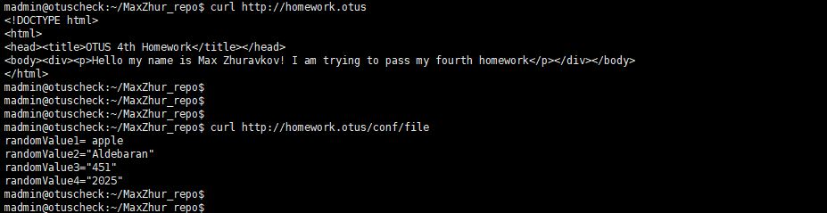

# Четвертое домашнее задание(ДЗ).
## Подготовка
Проверялось на версии minikube 1.35, kubectl 1.32 на VM с Ubuntu 24.04
1. Клонируем ветку kubernetes-networks туда, где есть настроенный minikube и kubectl.
2. Устанавливаем ingress-controller
```
minikube addons enable ingress
```
3. Находим IP адресс ноды minikube и прописываем его в /etc/hosts с алиасом homework.otus
```
kubectl get node -o wide
```



## Запуск
1. Поочередно создаем namespace, configmap, pvc,  deployment, service и ingress
```
kubectl apply -f kubernetes-controllers/namespace.yaml
kubectl apply -f kubernetes-controllers/cm.yaml
kubectl apply -f kubernetes-controllers/pvc.yaml
kubectl apply -f kubernetes-controllers/deployment.yaml
kubectl apply -f kubernetes-controllers/service.yaml
kubectl apply -f kubernetes-controllers/ingress.yaml
```
2. Проверяем, что страница доступна
```
curl http://homework.otus
```
3. Проверяем значения из манифеста kubernetes-controllers/cm.yaml
```
curl http://homework.otus/conf/file
```



## Задание со звездочкой
1. Удаляем deployment
```
kubectl delete deployment depl-wserver -n homework
```
2. Удаляем pvc 
```
kubectl delete pvc homework-pvc -n homework
```
3. Создаём storageClass
```
kubectl apply -f kubernetes-controllers/storageClass.yaml
```
4. Создаем pvc с созданным storageClass
```
kubectl apply -f kubernetes-controllers/pvc2.yaml
```
5. Создаём deployment
```
kubectl apply -f kubernetes-controllers/deployment.yaml
```
6. Проверка работоспособности: пункты 2 и 3, из предыдущего раздела


